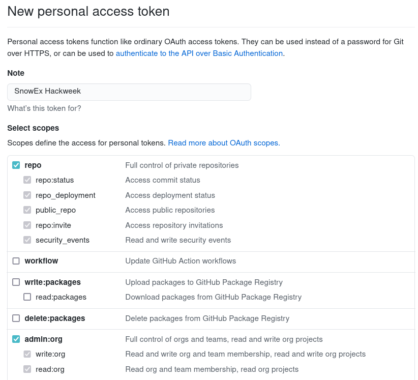

# Git

## Setting up on JupyterHub

Below are instructions to get you setup with `git` on the SnowEx hackweek 
JupyterHub. These are only basic instructions to get started. See the
[Software Carpentry Git](http://swcarpentry.github.io/git-novice/02-setup/index.html)
instructions for a more thorough explanation and background information.

### 1. Login to JupyterHub
See {ref}`accessing-jupyterhub` for instructions on setup and how to.

### 2. Open a Terminal
Choose the 'Terminal' from the 'Other' options in the 'Launcher' tab.


### 3. Configure basic `git` information
Set your username and email address. The email address should be the same
as you used to register your GitHub account.

```shell
git config --global user.name "SnowEx Attendee"
git config --global user.email "attendee@hackweek.com"
git config --global credential.helper 'cache --timeout 2678400'
```

The last line of the config will cache your GitHub credentials for one month
and will save you from re-entering your username and password from the command
line with each push and pull to GitHub.

To verify successful setting use the
```shell
git config -l
```
command.

The output should look similar to this:
```shell
jovyan@jupyter:~$ git config -l
user.name=SnowEx Attendee
user.email=attendee@hackweek.com
credential.helper=cache --timeout 2678400
```

### 4. Authenticating with GitHub
In order to pull and push changes to GitHub, you need to setup an authentication
method. For machines and environments that are not your personal, it is a good
practice to use a [GitHub personal access tokens](https://docs.github.com/en/github/authenticating-to-github/keeping-your-account-and-data-secure/creating-a-personal-access-token)
+++
For the hackweek, you need to check the **repo**, **admin:org**, and **workflow** scope.



Make sure that you save the token on your local computer as a backup
in case you need to re-authenticate again. You will need the token to access
your personal account as well as pushing to your project repository.

To cache your credentials via the token, we will be using a test repository from
the SnowEx Hackweek organization. Paste the following command into your open
terminal on the JupyterHub, where you will be prompted for your GitHub username
and the token. The output in your console should look similar to the below.

```shell
git clone https://github.com/snowex-hackweek/github_setup_check.git
```

You will be then prompted for your personal inputs.

```{attention}
Use your personal GitHub username instead of the placeholder `<GitHub Username>` 
in the below sample output. For the password, paste your crated token.
```

```shell
Cloning into 'github_setup_check'...
Username for 'https://github.com': <GitHub Username>
Password for 'https://snowex-attendee@github.com': 
remote: Enumerating objects: 3, done.
remote: Counting objects: 100% (3/3), done.
remote: Compressing objects: 100% (2/2), done.
remote: Total 3 (delta 0), reused 0 (delta 0), pack-reused 0
Unpacking objects: 100% (3/3), done.
```

To test the caching, go inside the repository and issue a `git pull`:
```shell
cd github_setup_check/
(notebook) jovyan@jupyter:~/github_setup_check$ git pull
Already up to date.
```

You should not be prompted for a password again. After this, you can delete 
the sample repository again via the UI or the command line.

#### Alternative GitHub interaction
In addition to interacting with GitHub via the `git` command, you can also use
the `gh` command, which is a set of [command line tools developed by GitHub to
interact with their website from the command line](https://cli.github.com/). 

Below output will set you up, using the `gh` command and your access token.
The answers to each question are shown in the output.

```shell
(notebook) jovyan@jupyter-jomey:~$ gh auth login
? What account do you want to log into? GitHub.com
? What is your preferred protocol for Git operations? HTTPS
? Authenticate Git with your GitHub credentials? Yes
? How would you like to authenticate GitHub CLI? Paste an authentication token
Tip: you can generate a Personal Access Token here https://github.com/settings/tokens
The minimum required scopes are 'repo', 'read:org', 'workflow'.
? Paste your authentication token: ****************************************
- gh config set -h github.com git_protocol https
✓ Configured git protocol
✓ Logged in as SnowExHackweek
```
