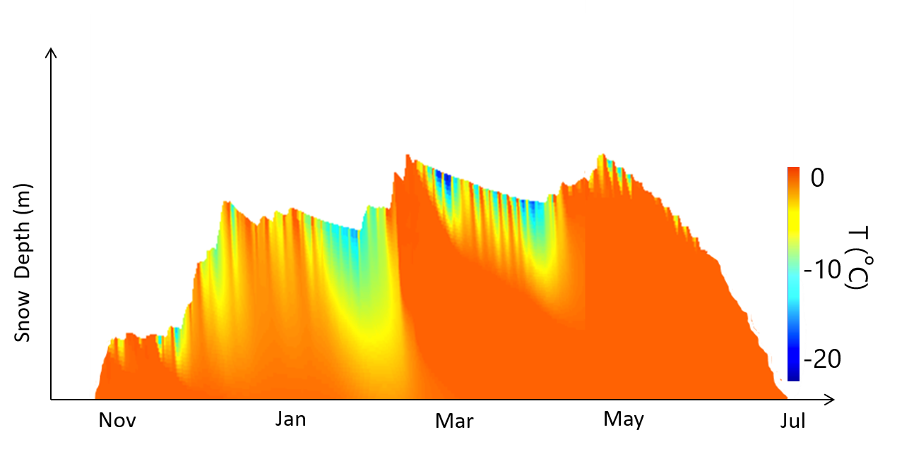

# Thermal Infrared Remote Sensing of Snow

:::{admonition} Learning Objectives

**At the conclusion of this tutorial, you will be able to:**
- understand the differences between sources of thermal IR observations, the advantages and disadvantages of each, and types of research questions we can address with those observations
- visualize point and raster thermal infrared datasets together, then compute error statistics between point and raster datasets
- access and visualize airborne and satellite thermal infrared imagery, then scale imagery of different spatial resolutions for comparison
- download datasets through the NASA Earthdata API
- use data conversion tools to create geotiff files
:::

* [Thermal IR observations from SnowEx 2020](./thermal-ir-tutorial.ipynb)
  * Part 1: Comparing airborne IR imagery with ground-truth observations
  * Part 2: Satellite IR remote sensing obsevations
* [Downloading datasets through the NASA EarthData API](./thermal-ir-data-download.ipynb)
  * earthdata_api.py
* [ASTER L1T utilities from LP DAAC Data User Resources](https://git.earthdata.nasa.gov/projects/LPDUR/repos/aster-l1t/browse)
  * ast-l1t/README.md
  * ast-l1t/ASTERL1T_hdf2tif.py

## Why do we want thermal images of snow?

Observations of snow surface temperature can tell us about the energy state of the snowpack, and tell us when the surface reaches melting point. The surface temperature represents the upper boundary of the energey balance within snow layers, and also the lower boundary layer for turbulent energy fluxes. We can use observations of snow surface temperature as a diagnostic tool to assess how well snow models represent this energy balance and the onset of snowmelt. (For example, see [Lapo et al., 2015](https://agupubs.onlinelibrary.wiley.com/doi/full/10.1002/2014WR016259)) 

:::{figure-md} snowtemp
  

Example of snow depth over time illustrating snow temperature at different depths with colorbar. (Figure by Nic Wayand & Jessica Lundquist)
:::

A timeseries of snow surface temperature measurements at a single point can give a detailed look into how temperature changes over time, but not how it varies across the landscape. Often, installing snow temperature sensors in an area of interest isn't possible. Images of snow surface temperature from satellites or aircraft can provide insight into the snow surface energy balance across a large area such as an entire watershed in a single image. While we can get satellite imagery of anywhere on the globe, these images only provide a snapshot in time each time the satellite passes overhead. Many satellite remote sensing imagers you may already be familiar with include thermal infrared (TIR) bands (wavelengths between ~7-15 microns), such as Landsat, ASTER, Sentinel-3 SLSTR, MODIS, and VIIRS. Airborne TIR imagery, and now even using small drones, enables higher resolution images of targeted areas.

In this tutorial we'll look at both of these types of snow surface temperature data that were collected during the 2020 SnowEx campaign at Grand Mesa, Colorado:
* Point, timseries:
  * Ground-based snow surface temperature timeseries measured at a single snow pit (tripod-mounted thermal infrared radiometer)
* Raster (image):
  * Airborne thermal infrared imagery from the UW-APL IR instrument (onboard the NPS Twin Otter airplane)
  * Satellite thermal infrared imagery from ASTER (onboard NASA's Terra satellite)

## How does TIR remote sensing work?

Unlike Earth surface imagery in the visible portion of the [electromagnetic spectrum](https://science.nasa.gov/ems), which captures reflected sunlight, TIR imagery captures emitted electromagnetic radiation from the Earth surface itself. All materials emit electromagnetic radiation proportional to their temperature, and at typical temperatures encountered at Earth's surface or atmosphere, this emisstion is within the TIR part of the spectrum.

:::{tip}
You can review some of the physics of electromagnetic radiation with [this fantastic resource](https://gsp.humboldt.edu/OLM/Courses/GSP_216_Online/lesson1-2/index.html).
:::

Much like cameras that observe the visible wavelengths, TIR cameras detect the emitted radiance with an array or line of sensors to form an image of Earth's surface. We can call this observed quantity "spectral radiance" (radiance observed for an interval of wavelengths in the electromagnetic spectrum that the TIR camera is sensitive to).

The temperature of the imaged objects can be estimated by inverting the Planck function, which relates spectral radiance to an object's blackbody temperature. (See [Lundquist et al., 2018](https://doi.org/10.1016/j.rse.2018.03.001) for more details.)

Using the Planck function to solve for spectral radiance:

$L(\lambda,T)=\frac{2hc^2}{\lambda^5} \frac{1}{e^{\frac{hc}{\lambda k_B T}}-1}$

Inverting the Planck function to solve for brightness temperature:

$T_B(\lambda,L)=\frac{hc}{k_B \lambda} ln^{-1}(1+\frac{2hc^2}{L \lambda^5})$

This "brightness temperature" is the temperature the object would be at if it were a perfect emitter of TIR radiation, or "blackbody". To estimate the object's true kinetic temperature, we can use the material's emissivity ($\varepsilon$), which ranges between 0 and 1, to compute kinetic temperature ($T$) from brightness temperature ($T_B$).

$T = \varepsilon T_B$

Snow has a very high emissivity (0.98-0.99) (except for coarser grained snow, or snow viewed at a large incidence angle, see [Warren, 2019](https://royalsocietypublishing.org/doi/full/10.1098/rsta.2018.0161#d3e1356) for more details). Therefore, in this tutorial we will just work assuming that snow brightness temperature in the TIR wavelengths is close enough to its actual kinetic temperature for our purposes (assume emissivity = 1).
        

## What kinds of data will we be using?

During the field campaign at Grand Mesa, we wanted to capture the spatial variabilities of surface temperature and how temperatures changed over time. While at each snow pit surface temperature was logged and its precise time of measurement recorded, we also wanted a continuous timeseries of temperature measurements at a point in open snow that would be visible by airborne and satellite-based remote sensing. 

In the figure below, the field campaign map (left) showing snow pit locations and flight-line paths is annotated with two snow surface temperature timeseries measurements sites, the *Mesa West* meteorlogical station, and *Snow Pit 2S10*. We will use data from snow pit 2S10 for this tutorial.

The UW-APL thermal IR imager (center) was flown over Grand Mesa several times over the course of the field campaign. We will use a single flight-line mosaic image in this tutorial. (Thank you to Chris Chickadel at the UW APL for this data collection!)

The aircraft flight times were planned to be coincident with remote sensing satellites passing overhead. We will use a single ASTER thermal infrared image (right) in this tutorial that was taken at the same time as our example airborne IR mosaic.

:::{figure-md} summary
  

Data sources for this tutorial from the SnowEx 2020 field campaign at Grand Mesa.
:::

For more details, see this presentation: [Snow Surface Temperature & Thermal Infrared Remote Sensing](https://spestana.github.io/assets/docs/snowex-presentation-aug2020.pdf) duing the Grand Mesa IOP, SnowEx 2020

## Project ideas using these data:
* Compare more snow pit temperature data (using snowexsql queries) against airborne and satellite IR imagery
* Investigate spatial patterns of snow temperature from open areas to forested areas on the mesa, differences between ASTER and airborne IR imagery
* Improved data visualization using [hvplot](https://hvplot.holoviz.org/) or something similar to create interactive plots of IR and/or visible imagery
* Compare thermal infrared and SAR imagery, or snow temperature observations and snow model outputs

:::{note}
*Contact Steven Pestana during the hackweek for help accessing more airborne IR or visible imagery and related datasets.*
:::

## Additional learning resources:
:::{seealso}

**[NumPy](https://numpy.org) learning resources:**
* [NumPy and the ndarray](https://github.com/waterhackweek/waterdata/blob/master/gridded_data_tutorial_0.ipynb)
* [NumPy: the absolute basics for beginners](https://numpy.org/devdocs/user/absolute_beginners.html)
* [NumPy: creating and manipulating numerical data](https://scipy-lectures.org/intro/numpy/index.html)
* [Advanced NumPy](https://scipy-lectures.org/advanced/advanced_numpy/index.html)
* [NumPy for MATLAB users](https://numpy.org/doc/stable/user/numpy-for-matlab-users.html)

**[Xarray](https://xarray.pydata.org/en/stable/) and [rioxarray](https://corteva.github.io/rioxarray/stable/) learning resources:**
* [Introduction to xarray](https://github.com/waterhackweek/waterdata/blob/master/gridded_data_tutorial_1.ipynb)
* [GeoHackWeek 2019 raster tools](https://github.com/geohackweek/raster-2019)
* [rasterio](https://rasterio.readthedocs.io/en/latest/)
* [cartopy](https://scitools.org.uk/cartopy/docs/latest/)

**[ASTER](https://asterweb.jpl.nasa.gov/) resources:**
* [ASTER L1T Scripts and Tutorials](https://git.earthdata.nasa.gov/projects/LPDUR/repos/aster-l1t/browse)
* [Validating ASTER Thermal Infrared Imaging for use in Snow Models](https://github.com/UW-GDA/aster-thermal/)
:::
